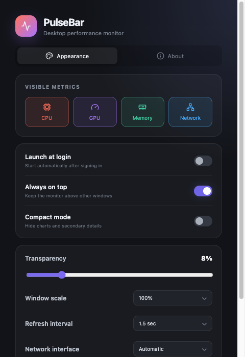

# PulseBar

[English](README.md) | **简体中文**

PulseBar 是一款面向 macOS 和 Windows 的小巧桌面性能监视器。它以半透明长条浮窗展示 CPU、GPU、内存和网络状态，在保持信息清晰的同时尽量减少对工作的干扰。

<p align="center">
  <a href="https://github.com/xiangzhong26/PulseBar/releases/latest"></a>
  <a href="https://github.com/xiangzhong26/PulseBar/releases"></a>
</p>

## 下载

> [!IMPORTANT]
> 可直接安装的版本请前往 **[GitHub 最新发布页](https://github.com/xiangzhong26/PulseBar/releases/latest)** 下载。安装版不需要 Node.js。

| 系统 | 推荐下载 | 其他版本 |
| --- | --- | --- |
| Windows 10/11 x64 | **EXE 安装版** | 便携版 EXE |
| macOS Apple Silicon | **arm64 DMG** | arm64 ZIP |
| macOS Intel | **x64 DMG** | x64 ZIP |

> PulseBar 目前仍处于早期阶段，欢迎反馈问题、提交建议或参与贡献。

## 产品预览


<p align="center">
  
</p>

## 功能特性

- 实时监视 CPU、GPU、内存、上传和下载速度
- 高对比度指标配色与轻量历史曲线
- 无边框半透明浮窗，支持背景模糊和始终置顶
- 五档窗口缩放、透明度调节与紧凑模式
- 自由选择需要显示的性能指标
- 可选网络接口和数据刷新频率
- 自动识别系统语言，也可手动选择中文或英文
- 支持 macOS 和 Windows 开机自启
- 托盘快捷操作与本地设置持久化
- 无遥测、无账号、无云端服务

## 运行要求

- macOS 11 或更高版本，支持 Apple Silicon 和 Intel
- Windows 10 或更高版本，x64
- 开发环境需要 Node.js 20 或更高版本

GPU 利用率取决于操作系统和显卡驱动所提供的数据。部分 macOS 设备或虚拟机可能会显示 GPU 数据不可用。

## 快速开始

```bash
git clone https://github.com/xiangzhong26/PulseBar.git
cd PulseBar
npm install
npm run dev
```

使用 `npm start` 可以在本地运行最近一次的生产构建。

## 从源码构建

```bash
# 构建当前系统版本
npm run dist

# 构建 macOS DMG 和 ZIP
npm run dist:mac

# 构建 Windows NSIS 安装包和便携版
npm run dist:win
```

构建产物会写入 `release/` 目录。为了获得最稳定的原生依赖、签名与打包结果，建议在 Windows 上构建 Windows 版本，在 macOS 上构建 macOS 版本。

预构建的 DMG 和 EXE 安装包会发布到 [GitHub Releases](https://github.com/xiangzhong26/PulseBar/releases)。推送 `v0.0.0` 这样的版本标签后，跨平台发布工作流会自动运行。

## 支持 PulseBar

如果 PulseBar 对你有帮助，可以通过 **[爱发电](https://afdian.com/a/xiangzhong26)** 支持项目。其他支持方式可以在软件的“关于”页面中查看。

## 自定义“关于”页

发布前请编辑 [`src/profile.js`](src/profile.js)：

```js
export const profile = {
  name: '你的公开昵称',
  github: 'https://github.com/xiangzhong26',
  avatar: 'https://example.com/public-avatar.png',
  donation: { url: 'https://afdian.com/a/xiangzhong26' },
}
```

应用会校验外部链接，仅允许打开 HTTP、HTTPS 和邮件链接。

## 多语言

PulseBar 默认跟随操作系统语言，用户也可在设置中手动选择简体中文或英文。翻译位于 [`src/i18n.js`](src/i18n.js)；添加新语言只需增加一组文案和对应的语言选项。

## 技术栈

- Electron：macOS 和 Windows 桌面容器
- React + Vite：界面与构建工具
- `systeminformation`：跨平台性能数据
- `electron-store`：本地设置存储

所有设置都保存在本机。PulseBar 不会收集或上传任何性能数据。

## 项目结构

```text
electron/          Electron 主进程与安全预加载桥接
src/main.jsx       监视器与设置界面
src/i18n.js        中英文翻译
src/profile.js     个人信息与打赏链接
src/styles.css     视觉系统与响应式布局
```

## 参与贡献

1. Fork 仓库并创建职责单一的分支。
2. 运行 `npm install` 和 `npm run dev`。
3. 尽可能保持修改在两个平台上可用。
4. 提交 Pull Request 前运行 `npm run build`。
5. 在 Pull Request 中说明与操作系统相关的行为。

## 开源许可

本项目基于 [MIT License](LICENSE) 开源。
